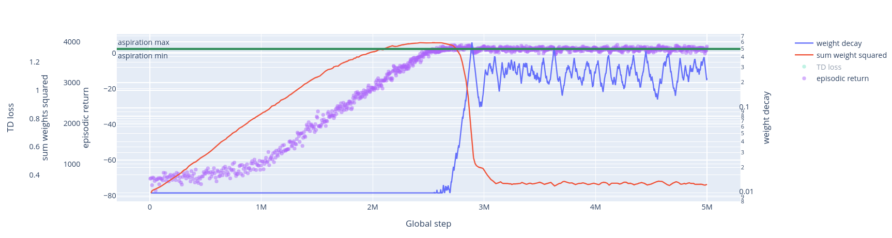
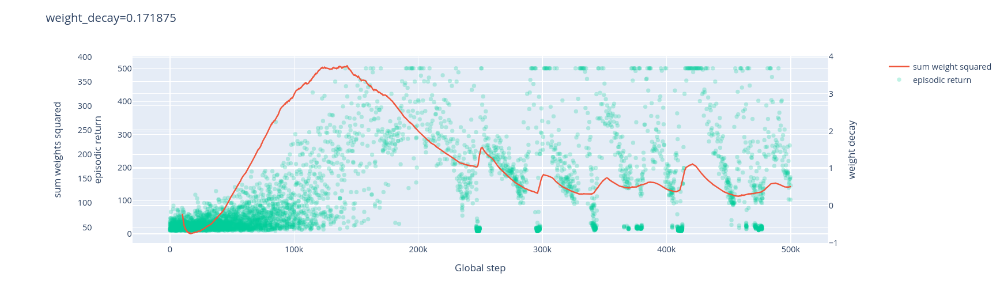
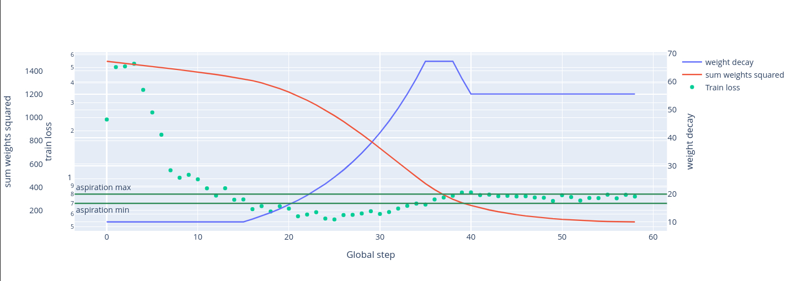
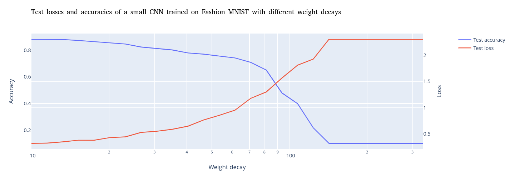
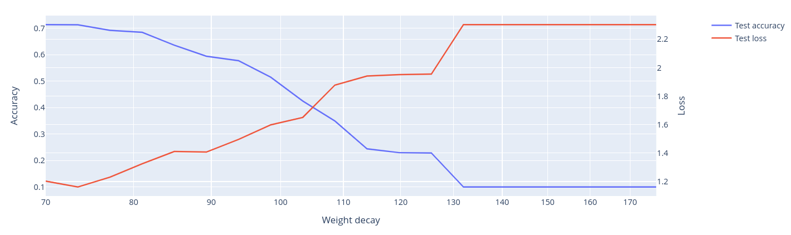
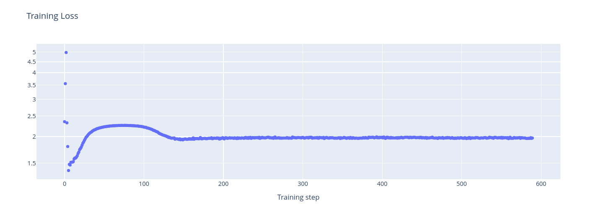

Definition: "total" = "episodic return" is the cumulative reward during one episode, or the average of the episodic reward 

Definition: "Training with weigth decay" means that when we train a neural network, we penalize the sum of the squares of the weights of the neural network.
This is often done by capability researchers because it improves performance or whatever (for example, the AdamW optimizer has a weight decay of 0.01 by default).
"The weight decay" is the importance of this penalty.
More exactly, when we train with weight decay, we do gradient descent on (loss + (weight decay) * (sum of the squares of the weights)).

What we do: we want to do aspiration learning by finding the biggest weight decay which makes the total fall in the aspiration interval on expected value.
This is motivated by the fact that if one sees the weight decay as a bias on simplicity (help: do we know how correct this assumption is?) we want to find the simplest network which's total falls in the aspiration interval (because simplicity is one of the safety criterion).

A very similar research direction I am equally excited about is doing the same thing but with a penalty on the distance of the model's weights and/or outputs from those of a less capable model we think to be less dangerous.

Sorry for the loaded language (reward, perfect, etc.)

# Aspiration learning on DQN via weight decay control

We train a DQN on a simple environment (checkers with a 4x4 board and simplified rules).
We control the weight decay in the following way:
- When the average total of the last 100 episodes is above the max aspiration, we muliply the weight decay by 1.01.
- When it is below the min aspiration, we divide the weight decay by 1.01.
- The weight decay is clipped to [0.5, 100].

Here is a smoother graph. The things that changed is that the enivorenment is bigger (now the board is 8x8) and learning is 5M timesteps long (10 times longer).

Details in order of importance:
- Test total: Although during training, the total seem to be not far away from the aspiration interval [0.4, 0.6] (or at least it is the case on the graph, I didn't do anything quantitative), the test total is much higher - 0.9. I strongly suspect this is because during training, the model is handicaped by the epsilon greedy exploration (that is every action the model takes has a 5% chance of getting replaced by a random action).
- Epsilon greedy exploration schedule: During the first half of the training, epsilon descends linearly from 1 to 0.05. During the second half, it is equal to 0.05.
- Algorithm: the DQN algorithm for CartPole from Stable Baselines
- Smooth plots: We no not plot the actual scatters/lines, but averages of every 100 consecutive points. One should imagine the real plot much more noisy.
- Model: Fully connected with hidden layer sizes 256, 256, 256 and ReLU
- Optimizer: AdamW. Thing didn't work quite well with Adam. My guess is this is because Adam and AdamW handle weight decay differently, though I don't know how either of them works.
- Environment: Checkers on a 4x4 board wiothut kings and when you arrive at the end of a board, you wrap around to the other end, like in some versions of snake game. It is not possible to eat more than one piece in one move. The agent plays against an oponent which plays random legal moves. The game ends when either player has no more pieces or cannot perform a legal move. It is not possible to skip moves. The agent plays first. Note that the environment is extremely simple: there are only 8 cells that can contain pieces and every player has only 2 pieces.
- Total: The agent receives a +1 reward when eating a piece, a -1 reward when the adversary eats a piece of the agent. So the maximal achievable total is 2. When the agent tries to play an illegal move, it receives a -1 reward and a random move is played instead (note that this explains why we have some very negative totals).

## Random things

### Biggest total achieved

When training with a constant weight decay of 0.01 (the default for the AdamW optimizer) (so we were just trying to maximize the total), we achieved a training total of about 1 and a test total of about 1.6.

### Clipping the weight decay

When we clipped the weight decay to [0.01, 100] instead of [0.5, 100], training was less stable.

We also noticed that during a training with weight decay clipped to [0.5, 100], the weight decay fell to 0.5 very regularly.

### This didn't work on cartpole

The same thing didn't work on cartpole (trained by the same implementation of the same DQN algorithm with the same hyperparameters except those of the network), even after somewhat thourough babysitting.

Actually, training with a rather big fixed weight decay doesn't work.
Instead of the average total staying in the middle, it oscillates between very low and near perfect (500 is the maximal total because there is a timeout).

Despite somewhat thorough babysitting, we observed that when trained with an adaptative weight decay, the cartpole agent behaves either similarly to the plot above or its total becomes near perfect or its total becomes very low.

#### Conjecture on why this could happen

All the following is very speculative

In the following, we assume that low sum of square weights means simpler model.

The aspiration is 150, which is quite high (a random policy achieves something like 15 or 25 if I remember correctly).
So it seems possible that the simplest policy which performs on average better than the aspiration is in fact the perfect policy.
We assume this is true.
Then, one cannot find a solution that is better than the aspiration but not perfect by penalizing complexity!
So one should expect what we did to fail.

One could say "But look, when the total first starts increasing, it increases smoothly! So the assumption and therefore the explanation is incorrect."
I argue that this counterargument is invalid. Indeed:
- Epsilon is bigger at the beginning - in fact, at the first step, epsilon is 1, so the policy is completely random!
- Even if epsilon were constant an we observed a smooth increase of the total (which I think we would), policies found earlier in training aren't necessarily simpler - they could be a more noisy/confused/drunk version of the same simple policy, for example.

If the explanation is correct, it would suggest training would work for smaller aspirations.
For example, the very simple policy of alwasy goin to the right if the angle of the pole is positive and to the left if it's negative has an average total of 42.
I am currently waiting for this experiment to finish computing.

# Supervised learning

Notice that our approach is not specific to reinforcement learning.
We applied it to a small CNN network on Fashion MNIST (the task of classifying 28 x 28 images of wardrobe items into 10 categories).

## Effect of fixed weight decay

We trained the same model on the same task with different weight decays and measured its performance.

And heer is the same graph with higher resolution and around the steepest point:

We train the model for 10 epochs.
When we trained it for 100 epochs (without doing aspiration learning, just trying to minimize the loss) we had overfitting problems - the test accuracy was 92.5% but the training accuracy was near perfect.

Note that many of the training loss graphs look like this for training this model with a fixed but rather big weight decay:

I observed a similar behavior when training an autoencoder with a penalty on the latent space for another project.
This might be a general phenomenon when training a neural network with both a loss and a penalty - does anyone know it?
